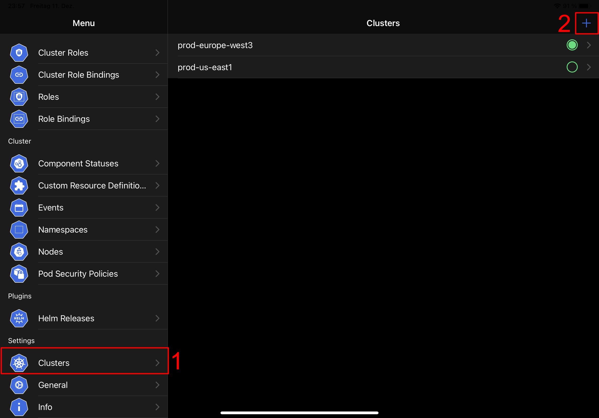
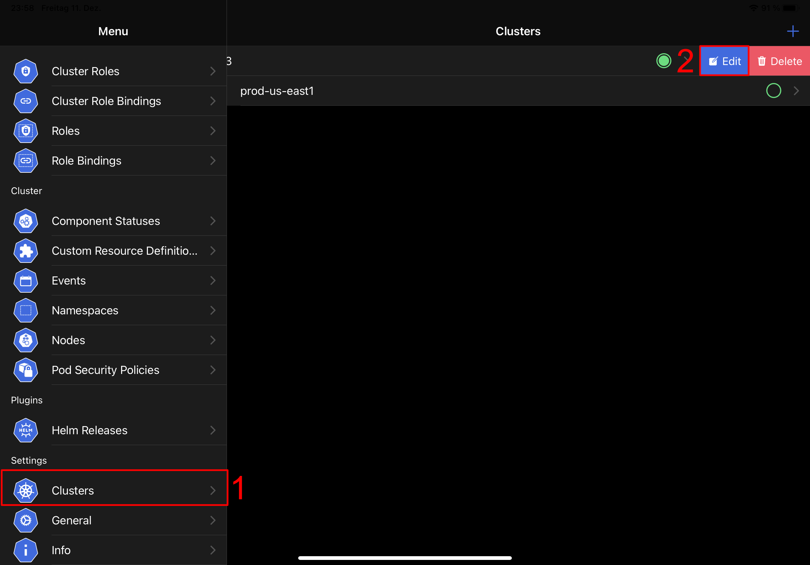
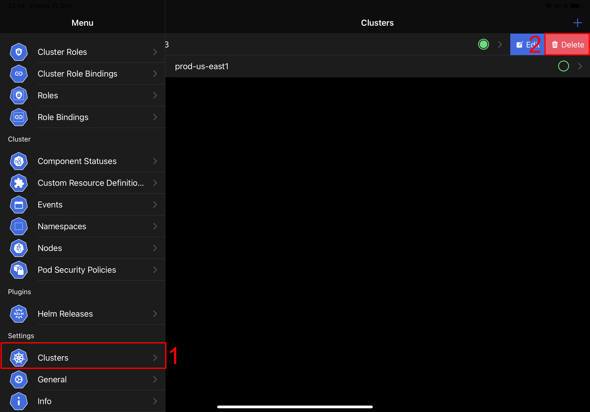
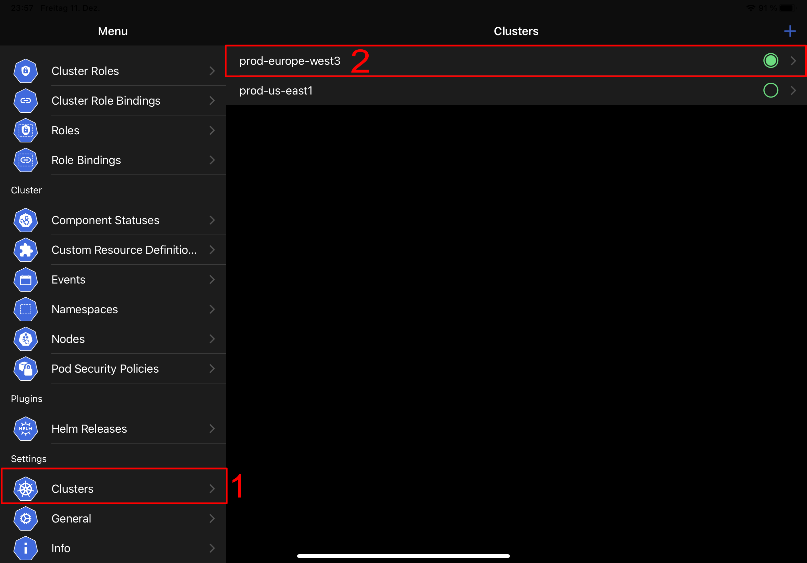
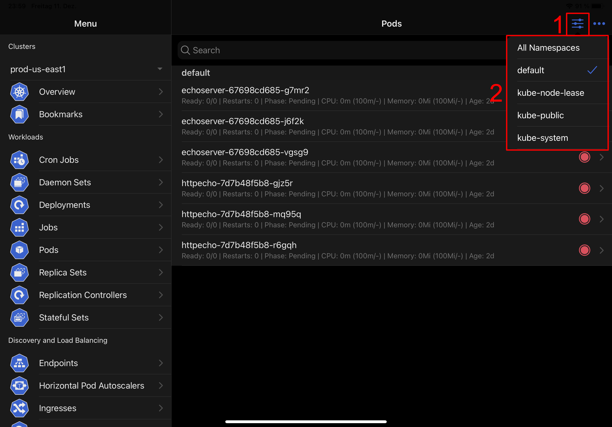
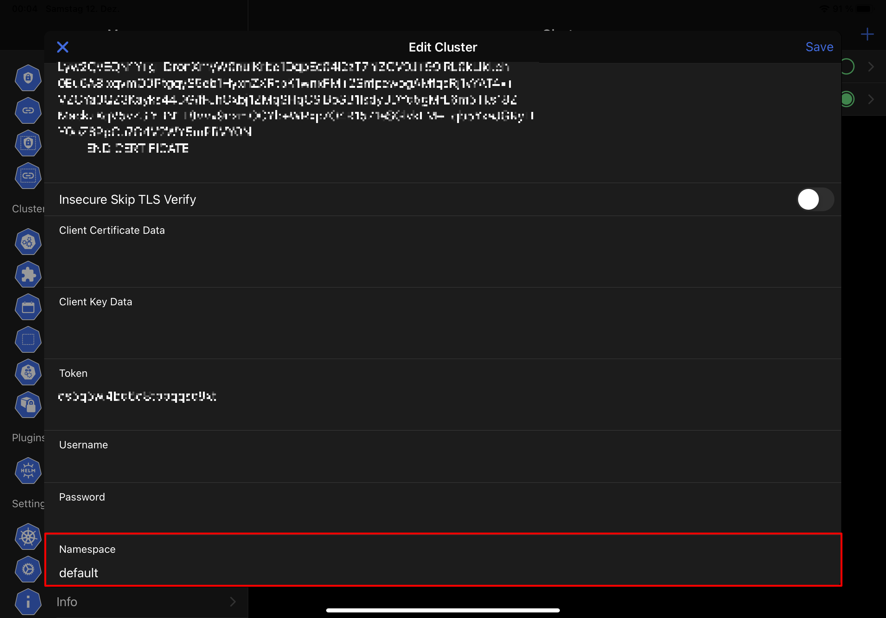

# Cluster Management

The following page shows, how you can add, edit or delete a cluster and how you can switch between clusters and namespaces.

## Add Cluster

To add a new cluster, you have to select the **Clusters (1)** item from the menu. Then you can add a new cluster via the **plus icon (2)**. Details to the different configuration options can be found on the following pages:

- [Google](google.md)
- [Amazon Web Services](amazon-web-services.md)
- [Microsoft Azure](microsoft-azure.md)
- [DigitalOcean](digital-ocean.md)
- [OIDC](oidc.md)
- [Kubeconfig](kubeconfig.md)
- [Manual](manual.md)

## Edit Cluster

To edit a cluster, you have to select the **Clusters (1)** item from the menu. Then you can **swipe left** the cluster and select the **Edit (2)** button, which becomes visible.

## Delete Cluster

To delete a cluster, you have to select the **Clusters (1)** item from the menu. Then you can **swipe left** the cluster and select the **Delete (2)** button, which becomes visible.

## Change Cluster

To change the active cluster, you have to select the **Clusters (1)** item from the menu. Then you can **select the cluster (2)**, which should be the active cluster.

You can also change a cluster, by **selecting the current cluster (1)** from the menu. Then a action sheet will become visible, where you have to **select the new active cluster (2)**.

## Change Namespace

You can change the namespace in each **list view** of a namespaced resource. To change the namespace, select the **options icon (1)** and then the namespace from from the **popover (2)**.

!!! attention
    This options requires the permission to list all namespaces. If you haven't this right you can choose the method from below, to change the namespace.

To change the active cluster, you have to select the **Clusters** item from the menu. Then swipe the cluster to the left and select **Edit**. In the modal, which becomes visible scroll to the bottom and enter the name of the namespace in the **Namespace** field.

