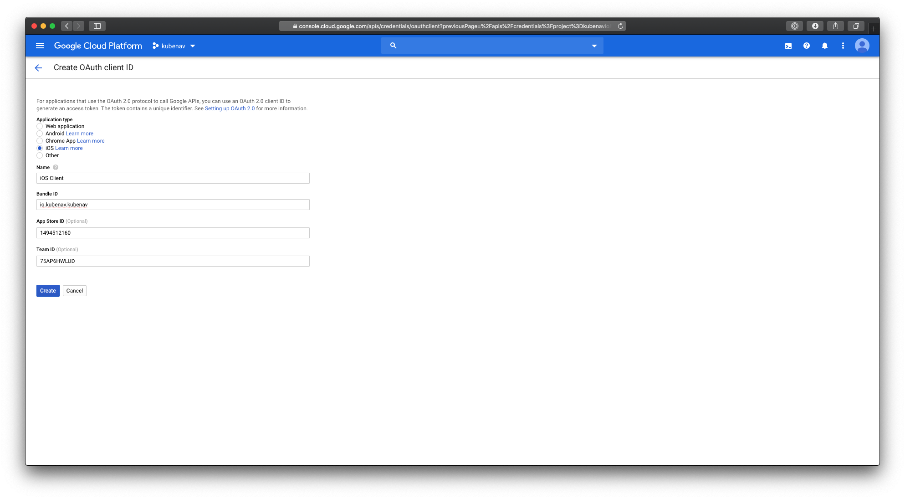
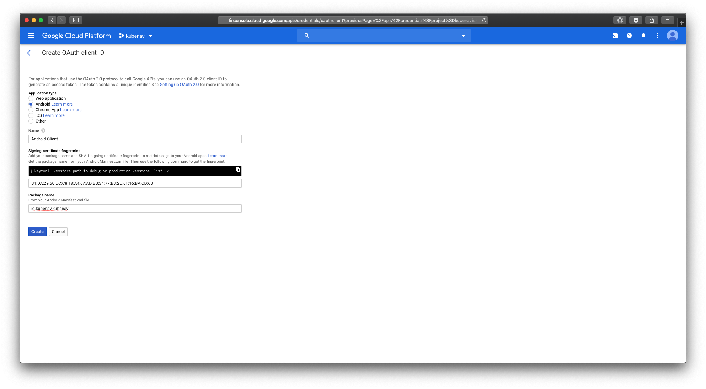

# Google

You can directly import your GKA clusters from Google Cloud. To import your GKE clusters you have to provide a valide **Client ID** from a Google OAuth 2.0 application. The instructions on how to configure such an application can be found in the following.

| Value | Description |
| ----- | ----------- |
| Client ID | A valid client id from an application, which was created via the [Google Cloud Console](https://console.cloud.google.com). |

## Google OAuth 2.0 Configuration

Login to the [Google Cloud Console](https://console.cloud.google.com) and choose **API & Services** and then **OAuth consent screen** from the menu.

Click on **EDIT APP** and add **https://www.googleapis.com/auth/cloud-platform** to the **Scopes for Google APIs** section. Then save your OAuth consent screen.

Select the **Credentials** item from the menu to get a new Client ID. Then click on **CREATE CREDENTIALS** and select **OAuth client ID**.

### iOS

Use the following settings for iOS:

- **Name:** iOS-Client
- **Bundle ID:** io.kubenav.kubenav
- **App Store ID:** 1494512160
- **Team ID:** 75AP6HWLUD

When you confirm your settings, via a click on the **Create** button, a modal opens with the **Client ID** you can use for kubenav.

### Android

Use the following settings for Android:

- **Name:** Android-Client
- **SHA-1 certificate fingerprint:** B1:DA:29:60:CC:C8:18:A4:67:AD:BB:34:77:BB:2C:61:16:BA:CD:6B
- **Package name:** io.kubenav.kubenav

> **Attention:** If you get an error message *"Duplicate fingerprint: The fingerprint you specified is already used by an Android OAuth2 client ID in this project or another project"* select another SHA-1 certificate fingerprint.

When you confirm your settings, via a click on the **Create** button, a modal opens with the **Client ID** you can use for kubenav.

### Activate APIs

In the last step you need to enable the **Kubernetes Engine API** and the **Cloud Resource Manager API**:

- **Kubernetes Engine API:** [https://console.cloud.google.com/apis/library/container.googleapis.com](https://console.cloud.google.com/apis/library/container.googleapis.com)
- **Cloud Resource Manager API:** [https://console.cloud.google.com/apis/library/cloudresourcemanager.googleapis.com](https://console.cloud.google.com/apis/library/cloudresourcemanager.googleapis.com)
