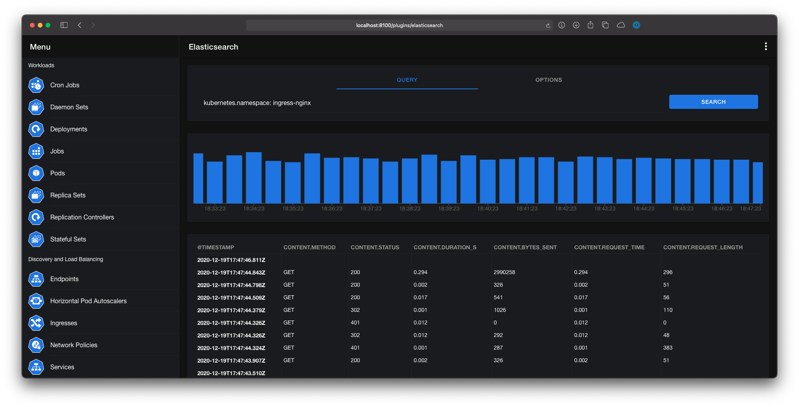

# Elasticsearch

The Elasticsearch plugin is used to query Elasticsearch for logs of your workloads.

The plugin can be enabled in the **Settings** for the mobile and desktop version. To use the plugin in the web version you have to set the `--plugin.elasticsearch.enabled` flag. A detailed explanation of the each setting and the required command-line flags can be found in the respective documentation:

- [Mobile](../mobile/settings.md#elasticsearch)
- [Desktop](../desktop/settings.md#elasticsearch)
- [Web](../web/command-line-flags.md)



## Query String Syntax

The Elasticsearch plugins uses the [query string syntax](https://www.elastic.co/guide/en/elasticsearch/reference/current/query-dsl-query-string-query.html#query-string-syntax) for filtering log lines.

### Field Names

You can specify fields to search in the query syntax:

- where the `status` field contains `active`

```txt
status:active
```

- where the `title` field contains `quick` or `brown`

```txt
title:(quick OR brown)
```

- where the `author` field contains the exact phrase `"john smith"`

```txt
author:"John Smith"
```

- where the `first name` field contains `Alice` (note how we need to escape the space with a backslash)

```txt
first\ name:Alice
```

- where any of the fields `book.title`, `book.content` or `book.date` contains `quick` or `brown` (note how we need to escape the `*` with a backslash):

```txt
book.\*:(quick OR brown)
```

- where the field `title` has any non-null value:

```txt
_exists_:title
```

### Wildcards

Wildcard searches can be run on individual terms, using `?` to replace a single character, and `*` to replace zero or more characters:

```txt
qu?ck bro*
```

### Regular Expressions

[Regular expression](https://www.elastic.co/guide/en/elasticsearch/reference/current/regexp-syntax.html) patterns can be embedded in the query string by wrapping them in forward-slashes (`"/"`):

```txt
name:/joh?n(ath[oa]n)/
```

### Fuzziness

We can search for terms that are similar to, but not exactly like our search terms, using the "fuzzy" operator:

```txt
quikc~ brwn~ foks~
```

### Ranges

Ranges can be specified for date, numeric or string fields. Inclusive ranges are specified with square brackets `[min TO max]` and exclusive ranges with curly brackets `{min TO max}`.

- All days in 2012:

```txt
date:[2012-01-01 TO 2012-12-31]
```

- Numbers 1..5

```txt
count:[1 TO 5]
```

- Tags between `alpha` and `omega`, excluding `alpha` and `omega`:

```txt
tag:{alpha TO omega}
```

- Numbers from 10 upwards

```txt
count:[10 TO *]
```

- Dates before 2012

```txt
date:{* TO 2012-01-01}
```

### Boolean operators

By default, all terms are optional, as long as one term matches.  A search for `foo bar baz` will find any document that contains one or more of `foo` or `bar` or `baz`.  We have already discussed the `default_operator` above which allows you to force all terms to be required, but there are also boolean operators which can be used in the query string itself
to provide more control.

The preferred operators are `+` (this term *must* be present) and `-` (this term *must not* be present). All other terms are optional. For example, this query:

```txt
quick brown +fox -news
```

### Grouping

Multiple terms or clauses can be grouped together with parentheses, to form sub-queries:

```txt
(quick OR brown) AND fox
```

## Date Math

The Elasticsearch plugin uses [date math](https://www.elastic.co/guide/en/elasticsearch/reference/current/common-options.html#date-math) to define the start and end time of a query.

The expression starts with an anchor date, which can either be `now`, or a date string ending with `||`. This anchor date can optionally be followed by one or more maths expressions:

- `+1h`: Add one hour
- `-1d`: Subtract one day
- `/d`: Round down to the nearest day

The supported time units differ from those supported by time-units for durations. The supported units are:

- `y`:: Years
- `M`:: Months
- `w`:: Weeks
- `d`:: Days
- `h`:: Hours
- `H`:: Hours
- `m`:: Minutes
- `s`:: Seconds

Assuming `now` is `2001-01-01 12:00:00`, some examples are:

- `now+1h`:: `now` in milliseconds plus one hour. Resolves to: `2001-01-01 13:00:00`
- `now-1h`:: `now` in milliseconds minus one hour. Resolves to: `2001-01-01 11:00:00`
- `now-1h/d`:: `now` in milliseconds minus one hour, rounded down to UTC 00:00. Resolves to: `2001-01-01 00:00:00`
- `2001.02.01\|\|+1M/d`:: `2001-02-01` in milliseconds plus one month. Resolves to: `2001-03-01 00:00:00`

## Annotations

You can add an annotation to your resources, to define Elasticsearch queries within these resources. The queries can be defined via the `kubenav.io/elasticsearch-queries` annotation.

The annotation requires a JSON array, where each item in the array can use the following fields:

| Field | Description | Default Value |
| ----- | ----------- | ------------- |
| `title` | A title for the defined query. | **Required** |
| `query` | Query to filter the Elasticsearch results in query string syntax. | **Required** |
| `from` | Start time for the query. | `now-15m` |
| `to` | End time for the query. | `now` |
| `selectedFields` | Comma separated list of fields, which should be shown in the results. | |

An annotation to get all logs for a Pod, can look as follows:

```yaml
apiVersion: v1
kind: Pod
metadata:
  annotations:
    kubenav.io/elasticsearch-queries: '[{"title": "All logs for the current Pod", "query": "kubernetes.namespace: $.metadata.namespace AND kubernetes.pod.name: $.metadata.name ", "selectedFields": "kubernetes.labels.app,host.name"}]'
  labels:
    app: kubenav
  name: kubenav-58d7f97f9f-462xd
  namespace: kubenav
spec:
```

You can use the `$.` operator, to select a field from the resource manifest, for example `$.metadata.namespace` will be replaced with the Namespace of the resource.

!!! attention
    When you are using the `$.` operator, the replacing will only work, when the term is starting and ending with a **space**.
