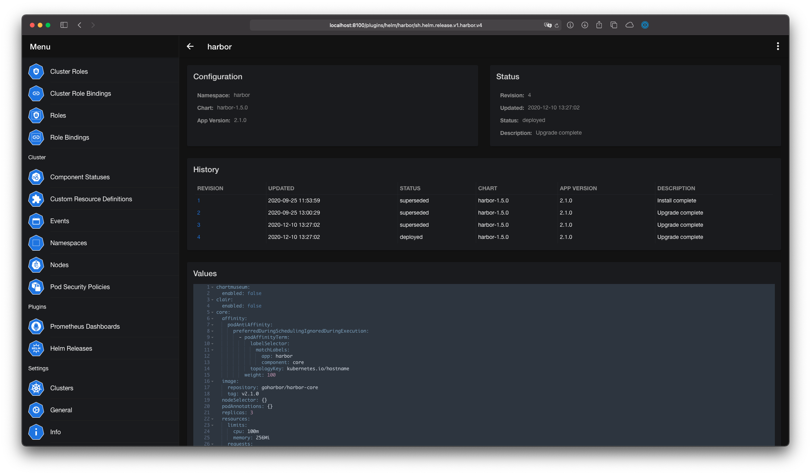

# Helm

The Helm plugin doesn't require any configuration. It can be found in the **Menu** under **Plugins**.

To use the Helm plugin, you need the permissions to view secrets, because Helm uses secrets as the [default storage driver](https://helm.sh/docs/faq/#secrets-as-the-default-storage-driver).

!!! attention
    The Helm plugin doesn't support infinite scrolling to load the secrets. If you have a lot of Helm charts in one namespace, you can increase the **Limit** parameter in the settings.

