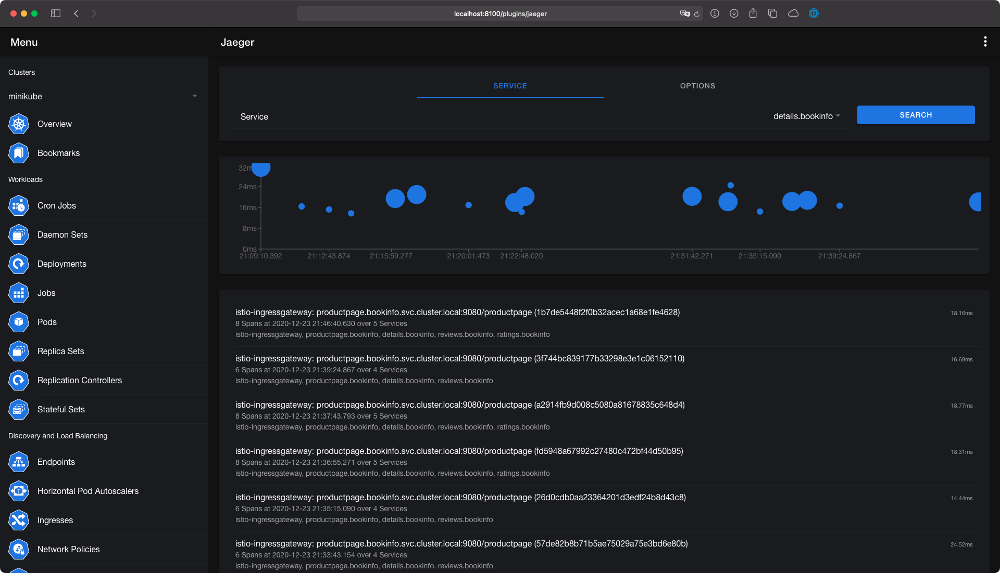
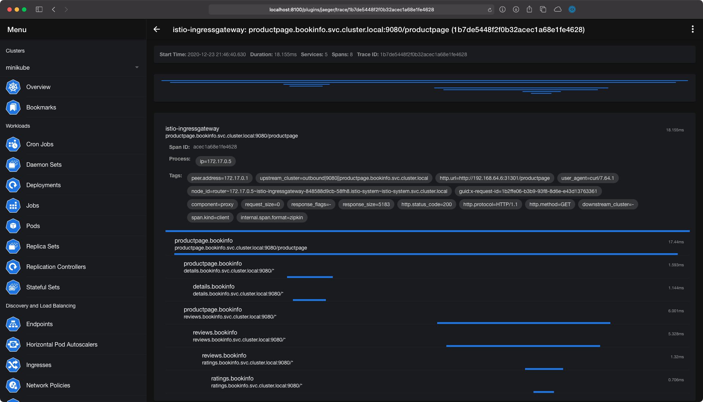

# Jaeger

The Jaeger plugin is used to find traces from Jaeger within kubenav. The plugin allows you to connect your resources with Jaeger services.

The plugin can be enabled in the **Settings** for the mobile and desktop version. To use the plugin in the web version you have to set the `--plugin.jaeger.enabled` flag. A detailed explanation of the each setting and the required command-line flags can be found in the respective documentation:

- [Mobile](../mobile/settings.md#jaeger)
- [Desktop](../desktop/settings.md#jaeger)
- [Web](../web/command-line-flags.md)



## Annotations

You can add an annotation to your resources, to define Jaeger Traces within these resources. The traces can be defined via the `kubenav.io/jaeger-traces` annotation.

The annotation requires a JSON array, where each item in the array can use the following fields:

| Field | Description | Default Value |
| ----- | ----------- | ------------- |
| `title` | A title for the defined trace. | **Required** |
| `service` | Service to get traces for. | **Required** |
| `operation` | The operation for which the traces should be retrieved. When this isn't provided traces are retrieved for all operations. | |
| `tags` | Filter traces by tags, for example `http.status_code=200 error=true` | |
| `lookback` | Time to lookback for traces. The value must be a valid Go duration ([ParseDuration](https://golang.org/pkg/time/#ParseDuration)). | `1h` |
| `maxDuration` | Maximum duration for a trace, for example `100ms`. | |
| `minDuration` | Minimum duration for a trace, for example `100ms`. | |
| `limit` | Number of traces, which are returned. | `20` |

An annotation to get all traces for a service named `details.bookinfo`, can look as follows:

```yaml
apiVersion: v1
kind: Pod
metadata:
  annotations:
    kubenav.io/jaeger-traces: '[{"title": "Traces for details.bookinfo", "service": "details.bookinfo"}]'
  labels:
    app: bookinfo
  name: details-v1-1520924117-48z17
  namespace: bookinfo
spec:
```


