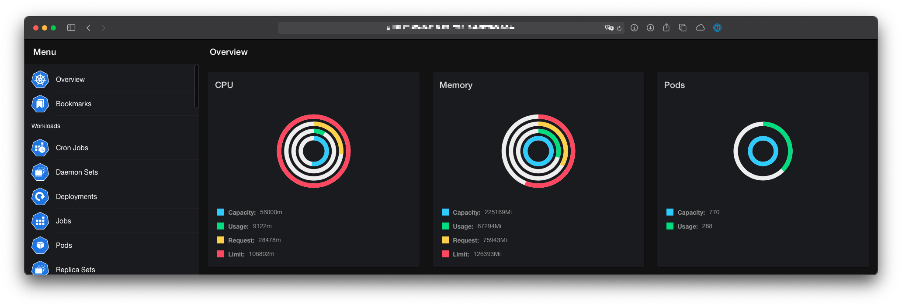
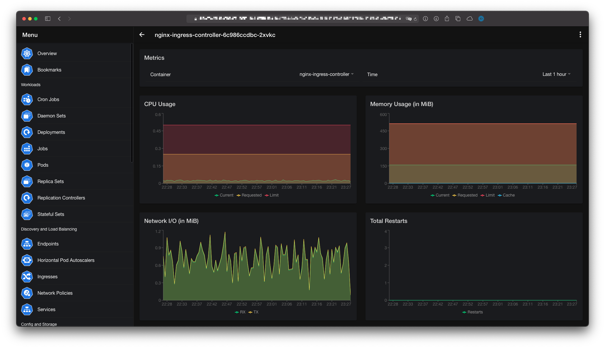
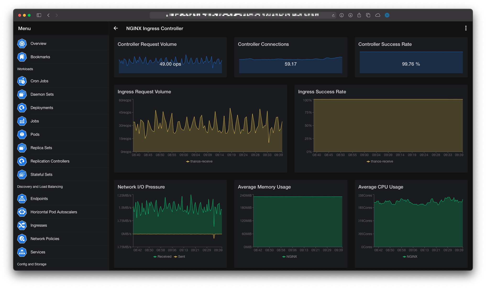

# Prometheus

The Prometheus plugin is used to display additional Prometheus metrics for Nodes, Deployments, StatefulSets, Pods, etc.

The plugin can be enabled in the **Settings** for the mobile and desktop version. To use the plugin in the web version you have to set the `--plugin.prometheus.enabled` flag. A detailed explanation of the each setting and the required command-line flags can be found in the respective documentation:

- [Mobile](../mobile/settings.md#prometheus)
- [Desktop](../desktop/settings.md#prometheus)
- [Web](../web/command-line-flags.md)

## Default Metrics

The Prometheus plugin supports some out of the box metrics for Nodes, Deployments, StatefulSets, Pods, etc. These metrics are generated by the [kube-state-metrics](https://github.com/kubernetes/kube-state-metrics) and the [node_exporter](https://github.com/prometheus/node_exporter), which must be installed by you.





## Dashboards

kubenav supports custom dashboards via the Prometheus plugin. To create a dashboard you have to create a ConfigMap in the defined dashboards namespace and with a label `kubenav.io/dashboard: "true"`.

```yaml
---
apiVersion: v1
kind: ConfigMap
metadata:
  # Name of the ConfigMap. The name is used as reference in the "kubenav.io/prometheus-dashboards" annotation.
  name: nginx-ingress-dashboard
  # Dashboards namespace, which is configured in the settings via "Dashboards Namespace" or via the "--plugin.prometheus.dashboards-namespace" command-line flag.
  namespace: kubenav
  labels:
    # Required label, so that kubenav can found the dashboard.
    kubenav.io/prometheus-dashboard: "true"
data:
  # Title of the dashboard.
  title: "NGINX Ingress Controller"
  # Description of the dashboard.
  description: "Dashboard for NGINX Ingress Controller Metrics"
  # Array of variables.
  variables: |
    [
      {
        "name": "Namespace",
        "label": "controller_namespace",
        "query": "nginx_ingress_controller_config_hash",
        "allowAll": true
      },
      {
        "name": "ControllerClass",
        "label": "controller_class",
        "query": "nginx_ingress_controller_config_hash{namespace=~\"{{ .Namespace }}\"}",
        "allowAll": true
      },
      {
        "name": "Controller",
        "label": "controller_pod",
        "query": "nginx_ingress_controller_config_hash{namespace=~\"{{ .Namespace }}\",controller_class=~\"{{ .ControllerClass }}\"}",
        "allowAll": true
      },
      {
        "name": "Ingress",
        "label": "ingress",
        "query": "nginx_ingress_controller_requests{namespace=~\"{{ .Namespace }}\",controller_class=~\"{{ .ControllerClass }}\", controller_pod=~\"{{ .Controller }}\"}",
        "allowAll": true
      }
    ]
  # Array of charts.
  charts: |
    [
      {
        "title": "Controller Request Volume",
        "unit": "ops",
        "size": {
          "xs": "12",
          "sm": "12",
          "md": "4",
          "lg": "4",
          "xl": "4"
        },
        "type": "singlestat",
        "queries": [
          {
            "label": "Request Volume",
            "query": "round(sum(irate(nginx_ingress_controller_requests{controller_pod=~\"{{ .Controller }}\",controller_class=~\"{{ .ControllerClass }}\",namespace=~\"{{ .Namespace }}\"}[2m])), 0.001)"
          }
        ]
      },
      {
        "title": "Controller Connections",
        "unit": "",
        "size": {
          "xs": "12",
          "sm": "12",
          "md": "4",
          "lg": "4",
          "xl": "4"
        },
        "type": "singlestat",
        "queries": [
          {
            "label": "Controller Connections",
            "query": "sum(avg_over_time(nginx_ingress_controller_nginx_process_connections{controller_pod=~\"{{ .Controller }}\",controller_class=~\"{{ .ControllerClass }}\",namespace=~\"{{ .Namespace }}\"}[2m]))"
          }
        ]
      },
      {
        "title": "Controller Success Rate",
        "unit": "%",
        "size": {
          "xs": "12",
          "sm": "12",
          "md": "4",
          "lg": "4",
          "xl": "4"
        },
        "type": "singlestat",
        "queries": [
          {
            "label": "Controller Success Rate",
            "query": "sum(rate(nginx_ingress_controller_requests{controller_pod=~\"{{ .Controller }}\",controller_class=~\"{{ .ControllerClass }}\",namespace=~\"{{ .Namespace }}\",status!~\"[4-5].*\"}[2m])) / sum(rate(nginx_ingress_controller_requests{controller_pod=~\"{{ .Controller }}\",controller_class=~\"{{ .ControllerClass }}\",namespace=~\"{{ .Namespace }}\"}[2m])) * 100"
          }
        ]
      },
      {
        "title": "Ingress Request Volume",
        "unit": "reqps",
        "size": {
          "xs": "12",
          "sm": "12",
          "md": "12",
          "lg": "6",
          "xl": "6"
        },
        "type": "area",
        "queries": [
          {
            "label": "{{ .ingress }}",
            "query": "round(sum(irate(nginx_ingress_controller_requests{controller_pod=~\"{{ .Controller }}\",controller_class=~\"{{ .ControllerClass }}\",namespace=~\"{{ .Namespace }}\",ingress=~\"{{ .Ingress }}\"}[2m])) by (ingress), 0.001)"
          }
        ]
      },
      {
        "title": "Ingress Success Rate",
        "unit": "%",
        "size": {
          "xs": "12",
          "sm": "12",
          "md": "12",
          "lg": "6",
          "xl": "6"
        },
        "type": "area",
        "queries": [
          {
            "label": "{{ .ingress }}",
            "query": "sum(rate(nginx_ingress_controller_requests{controller_pod=~\"{{ .Controller }}\",controller_class=~\"{{ .ControllerClass }}\",namespace=~\"{{ .Namespace }}\",ingress=~\"{{ .Ingress }}\",status!~\"[4-5].*\"}[2m])) by (ingress) / sum(rate(nginx_ingress_controller_requests{controller_pod=~\"{{ .Controller }}\",controller_class=~\"{{ .ControllerClass }}\",namespace=~\"{{ .Namespace }}\",ingress=~\"{{ .Ingress }}\"}[2m])) by (ingress) * 100"
          }
        ]
      },
      {
        "title": "Network I/O Pressure",
        "unit": "MB/s",
        "size": {
          "xs": "12",
          "sm": "12",
          "md": "12",
          "lg": "4",
          "xl": "4"
        },
        "type": "area",
        "queries": [
          {
            "label": "Received",
            "query": "sum (irate (nginx_ingress_controller_request_size_sum{controller_pod=~\"{{ .Controller }}\",controller_class=~\"{{ .ControllerClass }}\",namespace=~\"{{ .Namespace }}\"}[2m])) / 1024 / 1024"
          },
          {
            "label": "Sent",
            "query": "- sum (irate (nginx_ingress_controller_response_size_sum{controller_pod=~\"{{ .Controller }}\",controller_class=~\"{{ .ControllerClass }}\",namespace=~\"{{ .Namespace }}\"}[2m])) / 1024 / 1024"
          }
        ]
      },
      {
        "title": "Average Memory Usage",
        "unit": "MiB",
        "size": {
          "xs": "12",
          "sm": "12",
          "md": "12",
          "lg": "4",
          "xl": "4"
        },
        "type": "area",
        "queries": [
          {
            "label": "NGINX",
            "query": "avg(nginx_ingress_controller_nginx_process_resident_memory_bytes{controller_pod=~\"{{ .Controller }}\",controller_class=~\"{{ .ControllerClass }}\",namespace=~\"{{ .Namespace }}\"}) / 1024 / 1024"
          }
        ]
      },
      {
        "title": "Average CPU Usage",
        "unit": "Cores",
        "size": {
          "xs": "12",
          "sm": "12",
          "md": "12",
          "lg": "4",
          "xl": "4"
        },
        "type": "area",
        "queries": [
          {
            "label": "NGINX",
            "query": "sum (rate (nginx_ingress_controller_nginx_process_cpu_seconds_total{controller_pod=~\"{{ .Controller }}\",controller_class=~\"{{ .ControllerClass }}\",namespace=~\"{{ .Namespace }}\"}[2m]))"
          }
        ]
      },
      {
        "title": "Ingress Certificate Expiry",
        "unit": "Days",
        "size": {
          "xs": "12",
          "sm": "12",
          "md": "12",
          "lg": "12",
          "xl": "12"
        },
        "type": "area",
        "queries": [
          {
            "label": "{{ .host }}",
            "query": "(avg(nginx_ingress_controller_ssl_expire_time_seconds{namespace=~\"{{ .Namespace }}\"}) by (host) - time()) / 60 / 60 / 24"
          }
        ]
      }
    ]
```

### Variables

| Field | Description |
| ----- | ----------- |
| `name` | The name of the variable. The variable can then be used in other queries via `{{ .Name }}`. |
| `label` | Label from the returned Prometheus data, which should be used to fill the values of the variable. |
| `query` | Prometheus query, which should be used to get the values for the variable. |
| `allowAll` | Allows that the variable can have all values, which were returned from the query. Must be `true` or `false`. |

### Charts

| Field | Description |
| ----- | ----------- |
| `title` | Title for the chart. |
| `unit` | Unit for the Y-Axis. |
| `size` | Size defines the size of the chart in a 12 column grid layout. The size object should contain the following properties: `xs`, `sm`, `md`, `lg` and `xl` |
| `type` | The type of the chart. This must be `singlestat` or `area`, other types are currently not supported. |
| `queries` | An array of queries, which are used for the chart. Each query must contain a `label` and a `query`. |

### Annotations

You can also add a reference to a dashboard within a resource. For that you have to add the `kubenav.io/prometheus-dashboards` annotation to the resource. The value is a comma seperated list of the ConfigMap names of the dashboards plus an optional query parameter.

For example to add the *NGINX Ingress Controller* dashboard to an Ingress, the resource has to look as follows:

```yaml
apiVersion: extensions/v1beta1
kind: Ingress
metadata:
  annotations:
    # Add the NGINX Ingress Controller and NGINX Ingress Controller: Request Handling Performance dashboard to the Ingress.
    # Set the Ingress variable to kubenav, so that the Ingress is selected in the dashboard.
    # The second dashboard uses the name of the Ingress as value for the Ingress variable.
    kubenav.io/prometheus-dashboards: nginx-ingress-dashboard?Ingress=kubenav,nginx-ingress-request-handling-performance-dashboard?Ingress=$.metadata.name
    kubernetes.io/ingress.class: nginx
  name: kubenav
  namespace: kubenav
spec:
  rules:
  - host: dashboard.kubenav.io
    http:
      paths:
      - backend:
          serviceName: kubenav
          servicePort: http
        path: /
```

### Examples

In the [kubenav/deploy](https://github.com/kubenav/deploy/tree/master/dashboards) repository you can find some example dashboards, which are ready to use.

- `blackbox-exporter-dashboard.yaml`: Dashboard for [Blackbox Exporter](https://github.com/prometheus/blackbox_exporter)
- `cert-manager-dashboard.yaml`: Dashboard for [cert-manager](https://cert-manager.io)
- `elasticsearch-dashboard.yaml`: Dashboarf for [Elasticsearch Exporter](https://github.com/justwatchcom/elasticsearch_exporter)
- `filebeat-dashboard.yaml`: Dashboard for [Filebeat](https://github.com/trustpilot/beat-exporter)
- `go-dashboard.yaml`: Dashboard for [Go](https://github.com/prometheus/client_golang)
- `jaeger-dashboard.yaml`: Dashboard for [Jaeger](https://www.jaegertracing.io)
- `jetty-dashboard.yaml`: Dashboard for [Java](https://github.com/prometheus/client_java)
- `jvm-dashboard.yaml`: Dashboard for [Java](https://github.com/prometheus/client_java)
- `mongodb-overview-dashboard.yaml`: Overview dashboard for [MongoDB Exporter](https://github.com/percona/mongodb_exporter)
- `mongodb-replicaset-dashboard.yaml`: Replica Set dashboard for [MongoDB Exporter](https://github.com/percona/mongodb_exporter)
- `mongodb-wiredtiger-dashboard.yaml`: WiredTiger dashboard for [MongoDB Exporter](https://github.com/percona/mongodb_exporter)
- `nats-dashboard.yaml`: Dashboard for [NATS](https://nats.io)
- `nginx-ingress-dashboard.yaml`: Dashboard for [NGINX Ingress Controller](https://kubernetes.github.io/ingress-nginx/)
- `nginx-ingress-request-handling-performance-dashboard.yaml`: Performance dashboard for [NGINX Ingress Controller](https://kubernetes.github.io/ingress-nginx/)
- `node-exporter-dashboard.yaml`: Dashboard for [Node Exporter](https://github.com/prometheus/node_exporter)
- `nodejs-dashboard.yaml`: Dashboard for [Node.js](https://github.com/siimon/prom-client)
- `prometheus-dashboard.yaml`: Dashboard for [Prometheus](https://prometheus.io)
- `redis-dashboard.yaml`: Dashboard for [Redis](https://github.com/oliver006/redis_exporter)
- `redis-sentinel-dashboard.yaml`: Dashboard for [Redis Sentinel](https://github.com/leominov/redis_sentinel_exporter)
- `reloader-dashboard.yaml`: Dashboard for [Reloader](https://github.com/stakater/Reloader)
- `strimzi-kafka-dashboard.yaml`: Dashboard for [Strimzi](https://strimzi.io)
- `strimzi-kafka-exporter-dashboard.yaml`: Dashboard for [Strimzi](https://strimzi.io)
- `strimzi-operators-dashboard.yaml`: Dashboard for [Strimzi](https://strimzi.io)
- `strimzi-zookeeper-dashboard.yaml`: Dashboard for [Strimzi](https://strimzi.io)
- `thanos-compactor-dashboard.yaml`: Dashboard for [Thanos Compactor](https://thanos.io/tip/components/compact.md/)
- `thanos-querier-dashboard.yaml`: Dashboard for [Thanos Querier](https://thanos.io/tip/components/query.md/)
- `thanos-receiver-dashboard.yaml`: Dashboard for [Thanos Receiver](https://thanos.io/tip/components/receive.md/)
- `thanos-store-dashboard.yaml`: Dashboard for [Thanos Store](https://thanos.io/tip/components/store.md/)
- `varnish-dashboard.yaml`: Dashboard for [Varnish Exporter](https://github.com/jonnenauha/prometheus_varnish_exporter)


